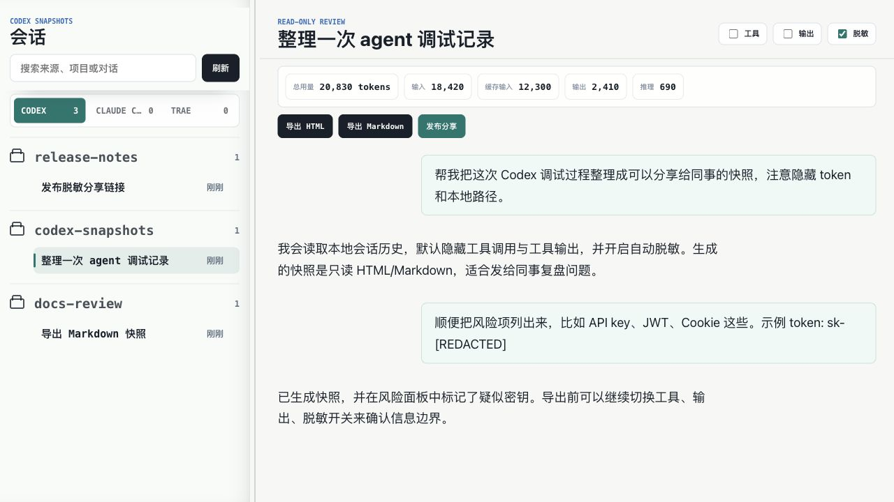
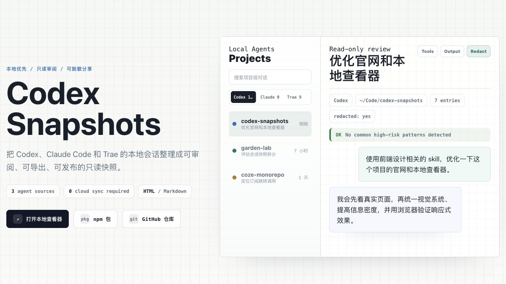
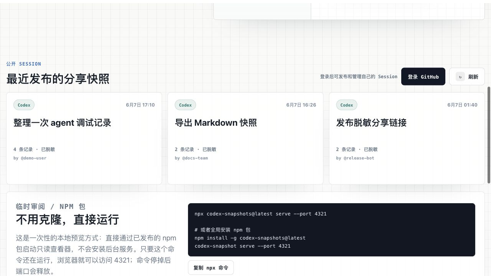

# Codex Snapshots

面向 Codex、Claude Code 和 Trae 的本地优先、只读会话快照工具。

它会把你电脑上的 agent 会话整理成可以浏览、导出、脱敏和分享的快照。适合用来复盘一次调试过程、沉淀问题排查记录，或者把一段 agent 协作过程发给同事看。

- 官网：<https://ffffhx.github.io/codex-snapshots/>
- npm：<https://www.npmjs.com/package/codex-snapshots>
- 仓库：<https://github.com/ffffhx/codex-snapshots>

## 它能做什么

- 读取本地 Codex、Claude Code、Trae 会话历史。
- 在浏览器里用只读界面查看会话内容。
- 默认隐藏 system/developer/bootstrap 消息和工具输出。
- 支持自动脱敏常见 token、密钥、Cookie、本地 home 路径等敏感信息。
- 支持导出 HTML / Markdown 快照。
- 支持在页面里一键发布已脱敏分享链接。

Codex Snapshots 默认不会上传你的本地会话。只有你在页面里主动点击 `发布分享` 时，才会把当前快照发送到配置好的分享服务。

## 截图

### 本地查看器



### 官网首页



### 公开分享列表



## 快速开始

要求 Node.js 18 或更高版本。

不需要克隆仓库，直接运行：

```bash
npx codex-snapshots@latest serve --port 4321
```

然后打开 <http://127.0.0.1:4321/>。

如果你想长期使用，可以全局安装：

```bash
npm install -g codex-snapshots@latest
codex-snapshot serve --port 4321
```

## 怎么使用

1. 打开本地查看器：<http://127.0.0.1:4321/>。
2. 在左侧选择 Codex、Claude Code 或 Trae 会话。
3. 查看会话内容，按需打开或关闭 `工具`、`输出`、`脱敏`。
4. 点击 `导出 HTML` 或 `导出 Markdown` 生成只读快照。
5. 如果需要发给别人，确认脱敏后点击 `发布分享`。

默认读取这些本地目录：

- Codex：`$CODEX_HOME` 或 `~/.codex`
- Claude Code：`$CLAUDE_HOME` 或 `~/.claude`
- Trae：`$TRAE_HOME` 或 `~/.trae-cn`
- Trae 应用数据：`$TRAE_APP_HOME` 或 `~/Library/Application Support/Trae CN`

## 开发者运行

如果你想改代码，可以从源码启动本地查看器：

```bash
pnpm install
pnpm dev
```

本地查看器默认运行在 <http://127.0.0.1:4321/>。

官网静态站点默认运行在 <http://127.0.0.1:4322/>。

## 安全说明

- 默认只展示用户和助手消息。
- 默认跳过 developer、system 和 bootstrap 消息。
- 默认隐藏工具调用和工具输出。
- 默认开启常见敏感信息脱敏。
- 导出的快照是静态、只读内容，接收方不能操作原始 agent 线程。

脱敏不是绝对可靠。发布或发送快照前，请先在页面里快速复核正文和风险提示。

## License

MIT
